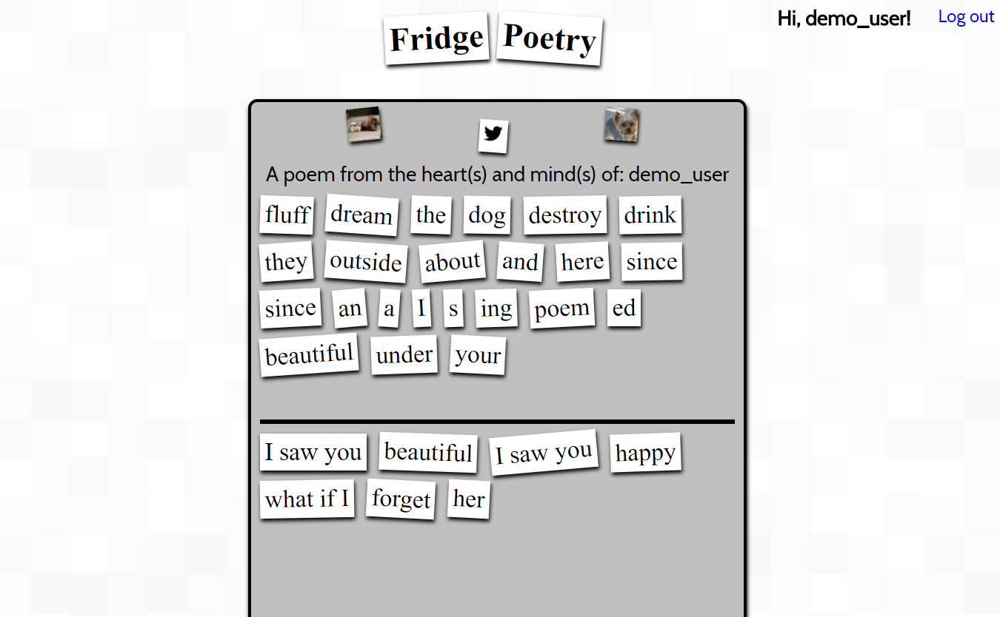

# fridge-poetry
a tool for collaborative fridge poetry

Description

Fridge Poetry allows users to recreate the experience of fridge poetry through the web. Users can create, edit, save, and delete poems
together with strangers on the internet. If a poem is particularly impressive, a Twitter link is provided to share a poem with the world.

Technologies

Frontend: 
-HTML5/CSS
-JavaScript
-jQuery
-jQuery UI

Backend:
-Node/Express
-Mongo(ose)
-Passport
-Jsonwebtoken
-brcyptjs
-mLab

-chai
-mocha

If you have any feedback or encounter any errors please don't hesitate to contact me: baron.roy@gmail.com

Have a nice day!
